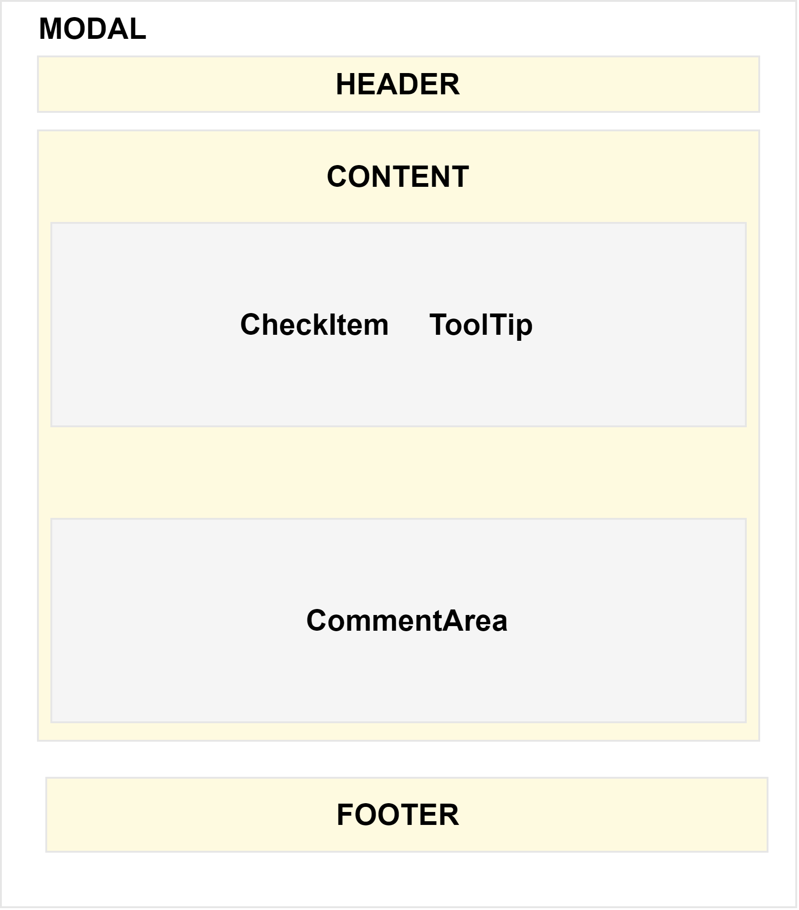

# React Modal Project

## Project Description

This project provides a dynamic modal component built with React.

## Features

- Dynamic modal creation
- Tooltip support
- User interaction management

## Technologies Used

- React
- Axios
- Jest (for testing)

## Installation

1. Clone the repository:
   ```bash
   git clone https://github.com/esrasrgl/modal.git
   ```
2. Install the dependencies:
   ```bash
   npm install
   ```
3. Update configuration:
   After running npm install, you will need to update the configuration file with your personal information. Open the config.js file and replace placeholders with your own values:

   ```jsx
   export const API_URL = "https://api.example.com";
   export const TOKEN = "your_token_id";
   ```

4. Start the project:
   ```bash
   npm start
   ```

## Running Tests

To run tests:

```bash
npm test
```

Detailed Reporting:

📜 You can find a description of the project tests in the  [linked document](https://docs.google.com/document/d/10OOTfRzK4lCq0L8eiTEr5-Aq40fH19GRxUmd8StzoJM/edit).


## Component Structure

This diagram shows the internal structure of the modal and how different components are organized within it.

<div align="center">
   
</div>

## Bugs

During test writing, even if `act` is not used explicitly, `screen` and `render` may use `act` in the background.

:warning: **Warning**: ReactDOMTestUtils.act is deprecated in favor of React.act. Import act from react instead of react-dom/test-utils. See https://react.dev/warnings/react-dom-test-utils for more info.

**Solution**:
To resolve this issue, install the latest version of `@testing-library/react`:
```bash
npm install --save-dev @testing-library/react
```